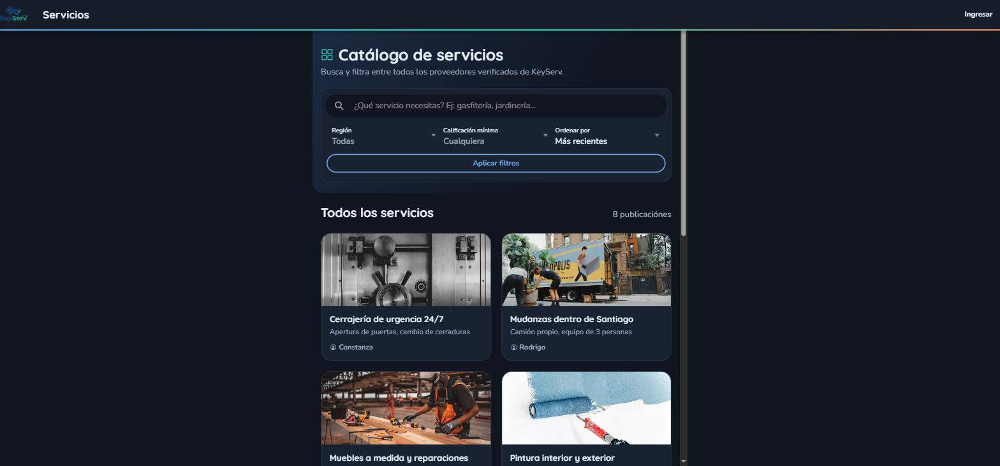
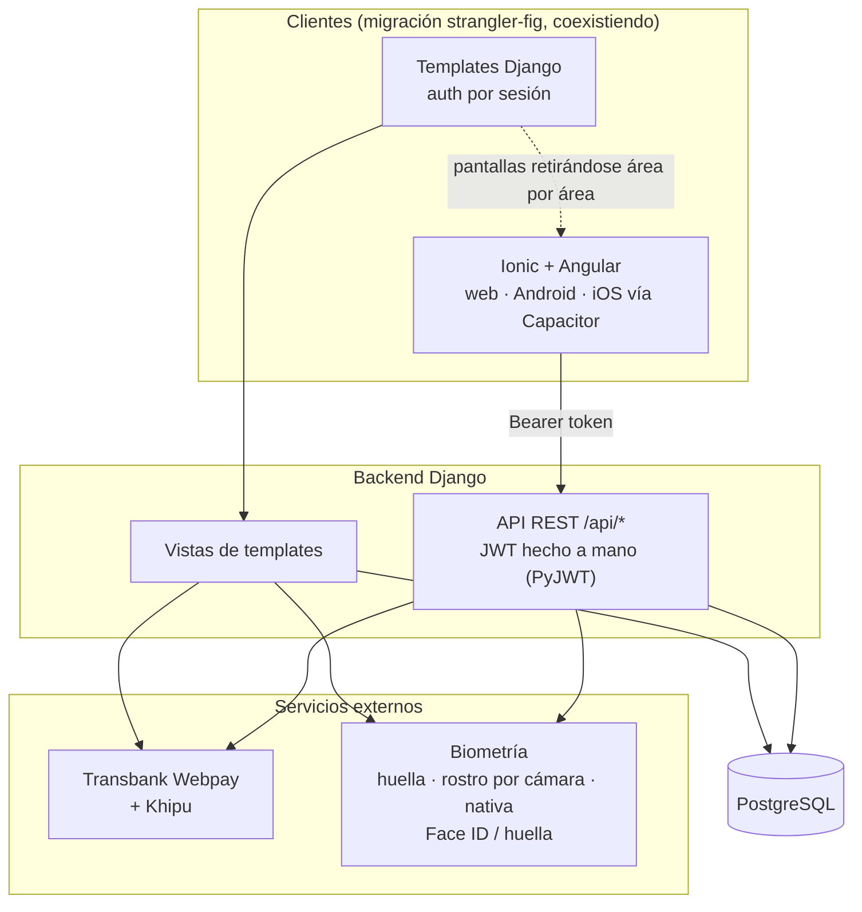

🇬🇧 [English](README.md) | 🇪🇸 Español

# KeyServ

[](https://github.com/KuityPipe/Tesis-Mejorada/actions/workflows/tests.yml)


[](LICENSE)

Un marketplace chileno de servicios del hogar con verificación biométrica de identidad (huella dactilar, reconocimiento facial por cámara, y Face ID/huella nativos del teléfono). Empezó como proyecto de tesis universitaria; hoy se sigue desarrollando como producto real.



## Demo en vivo

**[keyserv.netlify.app](https://keyserv.netlify.app)** — backend en Render (tier gratis, puede tardar ~50s en despertar en el primer request tras un rato inactivo), frontend en Netlify. Catálogo, cuenta/login, contrataciones y búsqueda por geolocalización están en vivo; la biometría nativa y el reconocimiento facial no son parte de este demo (para eso, el video, cuando exista). Credenciales demo:

- `cliente.demo@demo.keyserv` / `Demo1234` (cliente)
- `marcelo.gasfiteria@demo.keyserv` / `Demo1234` (proveedor)
- `admin` / `KeyServ2026!` (superuser, `/admin/` en el host de la API)

También corre local en pocos minutos — ver [Cómo correrlo local](#cómo-correrlo-local) abajo.

## Stack

- **Backend**: Django 5.2 + Django REST Framework, PostgreSQL 17
- **Frontend**: Ionic 8 + Angular 20 + Capacitor — un solo código para web, Android e iOS
- **Auth**: JWT hecho a mano (PyJWT), no `djangorestframework-simplejwt` — ver [Decisiones técnicas](#decisiones-técnicas)
- **Pagos**: Transbank Webpay Plus (tarjetas) + Khipu (transferencia bancaria)
- **Biometría**: pipeline de imagen de huella dactilar, reconocimiento facial por cámara con detección de vida por parpadeo, y biometría nativa del dispositivo (Face ID / huella vía Capacitor)
- **Ubicación**: búsqueda por geolocalización (posición real del dispositivo vía `@capacitor/geolocation`, distancia Haversine calculada en la API, filtro de radio), con vista previa de mapa + link a Google Maps en cada publicación
- **Tests**: 269 tests de backend + 59 de frontend, todos en verde

Actualmente coexisten dos frontends: los templates originales renderizados por Django y la nueva app Ionic/Angular, que habla con una API REST hecha con DRF. La migración a Ionic sigue un enfoque "strangler fig" — las pantallas se retiran del app de templates área por área, no en un solo corte grande.

## Arquitectura



## Decisiones técnicas

Algunas de las que defendería en una entrevista:

- **JWT hecho a mano en vez de `djangorestframework-simplejwt`.** El modelo `Usuario` de la app es anterior a la API y no es el `AUTH_USER_MODEL` de Django — `simplejwt` asume `get_user_model()` en varios lugares y no encaja bien. Una capa liviana de JWT (PyJWT para tokens de acceso sin estado + un refresh token opaco, hasheado y revocable) terminó siendo más simple que forzar el modelo de usuario existente para que encajara en una librería.
- **PostgreSQL sobre MySQL.** La tesis originalmente pedía MySQL; una vez que el proyecto pasó de entregable académico a producto, el mejor soporte de PostgreSQL para búsqueda de texto completo (`unaccent`, usado en la búsqueda del catálogo) y su encaje general con Django lo hicieron la mejor opción hacia adelante.
- **Modelo de confianza de la biometría nativa.** Cuando la app verifica identidad vía el Face ID/huella del propio teléfono (`@capgo/capacitor-native-biometric`), la verificación ocurre enteramente dentro del enclave seguro del dispositivo — el servidor estructuralmente no puede verificarla de forma directa. En vez de simular lo contrario, la API confía en una sesión JWT ya autenticada más la atestación de hardware del dispositivo, el mismo modelo de confianza que usan apps tipo banca, en vez de pedir una re-entrada de contraseña redundante que no agregaría seguridad real.
- **Dos pasarelas de pago, no una.** Pagar solo con tarjeta (Webpay) no cubre cómo paga en la práctica una parte importante de los chilenos — la transferencia bancaria directa (Khipu) es lo bastante común como para justificar la integración extra.

## Qué se rompió, y cómo se arregló

El historial de commits y `docs/BACKLOG.md` tienen el detalle completo; tres casos destacan:

- **Una request de 13 minutos que dejaba el servidor colgado para todos, no solo para quien probaba.** La verificación de vida por parpadeo del reconocimiento facial reintentaba con un detector de rostro neuronal mucho más pesado cada vez que el detector rápido no encontraba nada — y con poca luz, eso pasaba en casi todos los frames de una captura. Se encontró probando con un cuarto oscuro real, no con un test unitario. Se arregló sacando el fallback pesado y validando la calidad de imagen *antes* de intentar detectar el rostro, no después.
- **El modo oscuro perdiendo una pelea de CSS contra sí mismo, dos veces.** El propio stylesheet de modo oscuro de Ionic define varias variables de tema bajo un selector más específico (`:root.md`/`:root.ios`) que un `:root` plano, así que la paleta personalizada de la app seguía perdiendo la cascada pese a cargar después en el bundle — invisible leyendo el SCSS, solo se detectó revisando `getComputedStyle` en un navegador real.
- **Un login que "funcionaba" durante meses sin funcionar en realidad.** El template de login enviaba un campo `username` mientras el formulario detrás esperaba `email` — el form/view en aislamiento funcionaba bien (y también en cada test que se saltaba el template), así que nadie lo notó hasta que alguien intentó loguearse por la página real.

## Cómo correrlo local

```bash
# Backend
python -m venv venv
source venv/bin/activate  # o venv\Scripts\Activate.ps1 en Windows
pip install -r requirements.txt
cd codigo/backend/django
cp .env.example .env      # completar credenciales de BD
python manage.py migrate
python manage.py runserver 8000

# Frontend (otra terminal)
cd codigo/frontend/ionic
npm install
npm start                  # sirve en :8100
```

Necesita una instancia local de PostgreSQL (credenciales vía `.env`). Cuentas demo, una vez sembrados los datos: `admin` / `KeyServ2026!` (superusuario), `cliente.demo@demo.keyserv` / `Demo1234` (cliente), `marcelo.gasfiteria@demo.keyserv` / `Demo1234` (proveedor).

## Sobre el uso de IA

Este proyecto se construyó con Claude Code como par de desarrollo. Cada decisión de arquitectura y producto fue mía (ver [Decisiones técnicas](#decisiones-técnicas) arriba) — revisé y dirigí cada cambio, y verifiqué en vivo cada funcionalidad antes de darla por cerrada, incluyendo correr la app nativa Android en un emulador, probar la integración de pagos contra el sandbox real de Transbank, y probar el reconocimiento facial contra una webcam real. Usar IA para escribir el código me liberó tiempo para las decisiones que son el trabajo de ingeniería real: diseño, seguridad y arquitectura — las partes que puedo defender en una entrevista.

## Roadmap

- Un video corto (flujo de contratación, pago, app nativa Android con biometría)

## Licencia

[MIT](LICENSE) — permisiva, no impide relicenciar más adelante si esto crece más allá de un proyecto de portafolio.

## Más documentación

El proyecto mantiene documentación de ingeniería inusualmente detallada, escrita a medida que pasaba el trabajo y no después:

- [`docs/PLAN_MIGRACION_IONIC.md`](docs/PLAN_MIGRACION_IONIC.md) — el plan por fases de la migración de Django a Ionic
- [`docs/BACKLOG.md`](docs/BACKLOG.md) — gaps y decisiones registradas a lo largo del proyecto
- [`docs/DATABASE_DOCUMENTATION.md`](docs/DATABASE_DOCUMENTATION.md) — referencia del modelo de datos
- [Carta Gantt del desarrollo](https://claude.ai/code/artifact/aea584bb-cc91-4a5a-8bf0-238cd886903b) — evidencia de proceso, armada a medida que avanzaba el trabajo y no después
