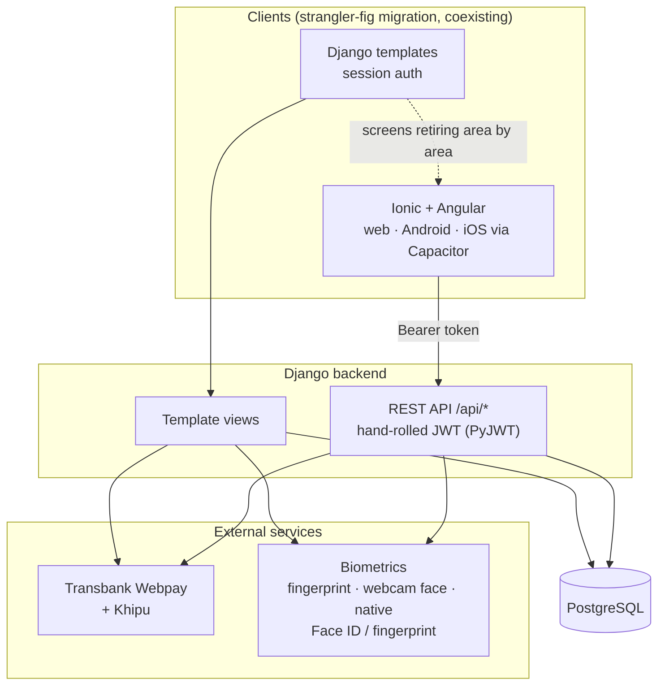

🇬🇧 English | 🇪🇸 [Español](README.es.md)

# KeyServ

[](https://github.com/KuityPipe/Tesis-Mejorada/actions/workflows/tests.yml)


[](LICENSE)

A Chilean home-services marketplace with biometric identity verification (fingerprint, webcam-based facial recognition, and native Face ID/fingerprint). Started as a university thesis project, now being developed as a real product.


## Live demo

Not deployed yet (see [Roadmap](#roadmap)). In the meantime, it runs locally in a few minutes — see [Running locally](#running-locally) below.

## Stack

- **Backend**: Django 5.2 + Django REST Framework, PostgreSQL 17
- **Frontend**: Ionic 8 + Angular 20 + Capacitor — one codebase for web, Android and iOS
- **Auth**: hand-rolled JWT (PyJWT), not `djangorestframework-simplejwt` — see [Technical decisions](#technical-decisions)
- **Payments**: Transbank Webpay Plus (cards) + Khipu (bank transfer)
- **Biometrics**: fingerprint image pipeline, webcam-based facial recognition with blink-liveness detection, and native device biometrics (Face ID / fingerprint via Capacitor)
- **Location**: geolocation-based search (real device position via `@capacitor/geolocation`, Haversine distance computed in the API, radius filter), with a map preview + Google Maps link on each listing
- **Tests**: 269 backend tests + 59 frontend tests, both green

Two frontends currently coexist: the original Django server-rendered templates and the new Ionic/Angular app, talking to a DRF REST API. The Ionic migration follows a strangler-fig approach — screens are retired from the template app one area at a time, not in one big cutover.

## Architecture



## Technical decisions

A few of the calls I'd defend in an interview:

- **Hand-rolled JWT instead of `djangorestframework-simplejwt`.** The app's `Usuario` model predates the API and isn't Django's `AUTH_USER_MODEL` — `simplejwt` assumes `get_user_model()` in several places and doesn't fit cleanly. A small JWT layer (PyJWT for stateless access tokens + an opaque, hashed, revocable refresh token) turned out simpler than bending the app's user model to fit a library.
- **PostgreSQL over MySQL.** The thesis brief originally specified MySQL; once the project moved past the academic deliverable, PostgreSQL's stronger support for full-text search (`unaccent`, used in the catalog search) and general fit for a Django app made it the better default going forward.
- **Native biometrics trust model.** When the app verifies identity via the phone's own Face ID/fingerprint (`@capgo/capacitor-native-biometric`), the check happens entirely inside the device's secure enclave — the server structurally cannot verify it directly. Rather than pretend otherwise, the API trusts an already-authenticated JWT session plus the device's hardware attestation, the same trust model banking-style apps use, instead of requiring a redundant password re-entry that wouldn't add real security.
- **Two payment gateways, not one.** Card payments alone (Webpay) don't cover how a meaningful share of Chileans actually pay for services — direct bank transfer (Khipu) is common enough to be worth the extra integration.

## What broke, and how it got fixed

The commit history and `docs/BACKLOG.md` have the full trail; three stand out:

- **A 13-minute request that froze the server for every user, not just the one testing it.** The facial-recognition liveness check retried with a much heavier neural face detector whenever the fast detector found nothing — which, in low light, was almost every frame of a capture burst. Found only by testing with a real dark room, not a unit test. Fixed by dropping the heavy fallback and checking image quality *before* attempting face detection, not after.
- **Dark mode losing a CSS fight with itself, twice.** Ionic's own dark-mode stylesheet defines several theme variables under a more specific selector (`:root.md`/`:root.ios`) than a plain `:root` override, so the app's custom palette kept losing the cascade despite loading later in the bundle — invisible from reading the SCSS, only caught by checking `getComputedStyle` in a real browser.
- **A login that "worked" for months without actually working.** The login template submitted a `username` field while the form behind it expected `email` — the raw form/view worked fine in isolation (and in every test that bypassed the template), so nothing caught it until someone tried logging in through the actual page.

## Running locally

```bash
# Backend
python -m venv venv
source venv/bin/activate  # or venv\Scripts\Activate.ps1 on Windows
pip install -r requirements.txt
cd codigo/backend/django
cp .env.example .env      # then fill in DB credentials
python manage.py migrate
python manage.py runserver 8000

# Frontend (separate terminal)
cd codigo/frontend/ionic
npm install
npm start                  # serves on :8100
```

Needs a local PostgreSQL instance (connection details via `.env`). Demo accounts, once seeded: `admin` / `KeyServ2026!` (superuser), `cliente.demo@demo.keyserv` / `Demo1234` (client), `marcelo.gasfiteria@demo.keyserv` / `Demo1234` (provider).

## About AI usage

This project was built with Claude Code as a development pair. Every architecture and product decision was mine (see [Technical decisions](#technical-decisions) above) — I reviewed and directed each change, and verified each feature live before considering it done, including running the native Android app on an emulator, testing the payment integration against Transbank's real sandbox, and testing facial recognition against a real webcam. Using AI to write the code freed up my time for the decisions that are the actual engineering work: design, security, and architecture — the parts I can defend in an interview.

## Roadmap

- A deployed demo (catalog + auth + contracting; native biometrics stay local-only, covered by a demo video instead)
- A short video walkthrough (contracting flow, payment, native Android app with biometrics)

## License

[MIT](LICENSE) — permissive, doesn't block relicensing later if this ever grows past a portfolio project.

## Further reading

The project keeps unusually detailed engineering docs, written as the work happened rather than after the fact:

- [`docs/PLAN_MIGRACION_IONIC.md`](docs/PLAN_MIGRACION_IONIC.md) — the phased plan for the Django-to-Ionic migration
- [`docs/BACKLOG.md`](docs/BACKLOG.md) — tracked gaps and decisions across the project
- [`docs/DATABASE_DOCUMENTATION.md`](docs/DATABASE_DOCUMENTATION.md) — data model reference
- [Development timeline (Gantt chart)](https://claude.ai/code/artifact/aea584bb-cc91-4a5a-8bf0-238cd886903b) — process evidence, built alongside the work rather than after the fact
