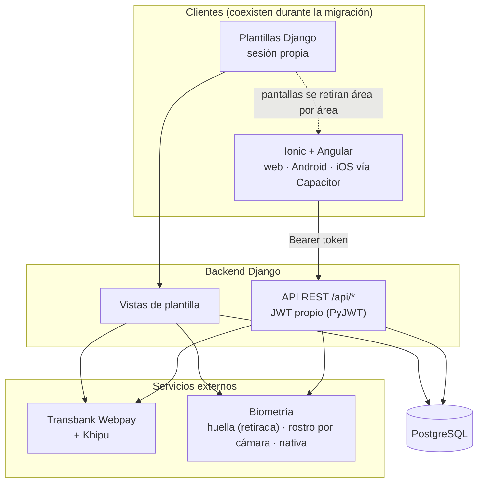

# KeyServ — Informe de Proyecto (versión actualizada)

## Nota sobre este documento

KeyServ nació en abril de 2023 como un Informe de Proyecto de Seminario de Grado — un trabajo académico con la estructura formal que exige ese tipo de entrega: portada institucional, autoría en conjunto, un académico guía, y capítulos dimensionados para una evaluación de titulación (incluyendo secciones de gestión de proyecto — costos, flujo de caja, auditoría formal — pensadas para calificar el proceso de un equipo de estudiantes, no para documentar un producto).

Este documento **no es esa entrega académica**. Es su continuación: mantiene la estructura de capítulos del informe original porque esa estructura sigue siendo la correcta para contar la historia completa de un proyecto de software (problema → solución → arquitectura → resultados → conclusiones), pero:

- **No repite el formato institucional** — sin portada, sin sección de agradecimientos, sin nombrar autores ni académico guía. El contenido queda escrito en la voz del proyecto, no de un equipo evaluado.
- **Reemplaza las secciones de gestión académica** (desglose formal de costos, flujo de caja, plan de auditoría, matrices de responsabilidades de equipo) por lo que realmente pasó después de la entrega: el proyecto se convirtió en un producto que se siguió desarrollando en solitario, usando Claude Code como par de desarrollo, con una disciplina real de control de versiones y checkpoints en lugar de un cronograma académico.
- **No duplica lo que ya está documentado en detalle en otros archivos de este repositorio.** Donde existe documentación técnica exhaustiva (`API_DOCUMENTATION.md`, `DATABASE_DOCUMENTATION.md`, `PLAN_MIGRACION_IONIC.md`, `BACKLOG.md`, `README.md`), este informe sintetiza y referencia en vez de copiar — la misma regla de "una sola fuente de verdad" que rige el resto del proyecto.
- **Está pensado para un lector técnico externo** (un futuro colaborador, potencial socio o cualquiera evaluando el proyecto técnicamente) que quiere entender qué es KeyServ hoy, de dónde viene, y por qué está construido como está — no para un evaluador académico.

El texto original de abril de 2023 sigue disponible sin modificar en `docs/academico/` (texto extraído y PDF de la plantilla institucional), para quien quiera compararlo con este documento o consultar el detalle académico completo (marco teórico extendido, IEEE 830, wireframes originales, anexos).

---

## Resumen

KeyServ es un marketplace de servicios del hogar (gasfitería, electricidad, jardinería, limpieza, cuidado de niños, y similares) construido en torno a un problema concreto del mercado informal chileno: la falta de confianza entre quien contrata un servicio y quien lo presta, agravada por estafas y la ausencia de mecanismos de verificación de identidad reales en las plataformas existentes. La propuesta original —verificación biométrica de los proveedores como garantía de identidad— sigue siendo el núcleo del producto, pero la solución de 2023 (una aplicación web monolítica en Django, biometría por huella y rostro, sin pagos reales) evolucionó hacia algo sustancialmente más amplio: una API REST con autenticación JWT propia, una aplicación Ionic/Angular multiplataforma (web, Android, iOS vía Capacitor), pagos reales integrados (Transbank Webpay Plus y Khipu), biometría nativa del dispositivo además del reconocimiento facial por cámara, búsqueda por geolocalización, un panel de moderación con roles reales, y un pipeline de integración continua que corre cientos de pruebas automatizadas en cada cambio. Hoy existe un demo desplegado públicamente (`keyserv.netlify.app`) y una build nativa Android firmada, verificados en vivo, no solo en ambiente local.

**Palabras clave:** marketplace de servicios, verificación biométrica, Django REST Framework, Ionic/Angular, JWT, Transbank, PostgreSQL.

---

## Capítulo I — Introducción

### 1. Introducción

El trabajo informal y la contratación de servicios a corto plazo (cuidado de niños, reparaciones del hogar, jardinería, mudanzas, y similares) siguen siendo un espacio de baja confianza en Chile: quien contrata no tiene forma real de verificar que la persona al otro lado es quien dice ser, y quien presta el servicio no tiene forma de acreditar su historial ante un cliente nuevo. El diagnóstico de 2023 —que la mayoría de las plataformas de este rubro no ofrece verificación de identidad real, y que eso alimenta el fraude y la desconfianza— sigue siendo válido; si acaso, se reforzó en la práctica al construir el producto: cada capa de seguridad agregada desde entonces (biometría nativa del teléfono, hardening de sesiones, registro de intentos de acceso sospechosos, moderación de contenido) respondió a huecos reales encontrados al construir y probar el sistema en serio, no a requisitos hipotéticos.

Lo que cambió no es el problema, sino el alcance de la respuesta. La tesis original planteaba una plataforma web con verificación por huella dactilar y reconocimiento facial como mecanismo único de confianza. El producto actual conserva esa columna vertebral pero la integra dentro de un sistema completo de transacción: contratación con flujo de estados y re-autenticación en pasos críticos, pago real (no una promesa de integración), mensajería por trabajo, calificaciones moderadas, y una app nativa multiplataforma en lugar de una sola interfaz web — todo verificado en vivo, no solo diseñado en papel.

### 2. Alcance de este documento

Este informe cubre el estado del proyecto **después** de la entrega académica de abril de 2023: qué se mantuvo del diseño original, qué se corrigió (varios errores reales de la implementación de entonces, documentados en el Capítulo III), qué se agregó por completo (pagos, la app Ionic, biometría nativa, despliegue en producción), y por qué se tomó cada decisión relevante. No repite el marco teórico extenso ni el levantamiento de requerimientos IEEE 830 del documento original — quien necesite ese detalle académico completo lo encuentra en `docs/academico/`.

---

## Capítulo II — Desarrollo del Proyecto

### 1. Identificación del problema (vigente, con ajustes)

El diagnóstico original se sostiene: la desconfianza en la contratación de servicios informales en Chile es real, está impulsada por la falta de verificación de identidad efectiva en las plataformas existentes, y una solución con verificación biométrica genuina tiene una ventaja competitiva clara frente a alternativas que solo piden un correo y una contraseña. Lo que la implementación real enseñó, y que el diagnóstico de 2023 no anticipaba del todo:

- La verificación biométrica **por sí sola** no basta como mecanismo de confianza completo — hace falta además un flujo de contratación con estados verificables (solicitud → confirmación → pago → ejecución → calificación), historial auditable, y un canal de comunicación entre las partes. La biometría certifica identidad; el resto del sistema certifica que la transacción ocurrió como se acordó.
- El pago es parte del problema de confianza, no un añadido aparte: sin un mecanismo de pago dentro de la plataforma, cliente y proveedor terminan negociando y pagando por fuera, exactamente el punto ciego que la propuesta original buscaba cerrar.

### 2. Formulación de la solución actualizada

**Formulación (2023, vigente):** KeyServ da solución al problema de estafas en la contratación de servicios de terceros mediante verificación biométrica del proveedor (huella dactilar y reconocimiento facial), gestión de perfil, y un mecanismo de reporte.

**Alcance ampliado (estado actual):**

- **Verificación biométrica**, ahora con tres mecanismos en lugar de uno: reconocimiento facial por cámara con detección de vida (parpadeo, ver sección 8), biometría nativa del dispositivo (Face ID/huella vía el enclave seguro del teléfono), y huella dactilar por imagen — esta última retirada de la aplicación web en favor de las otras dos, pero conservada como muestra de código funcional (ver Capítulo III).
- **Pago real integrado**, no solo diseñado: Transbank Webpay Plus (tarjetas) y Khipu (transferencia bancaria directa), ausentes por completo del alcance original de 2023.
- **Aplicación multiplataforma**: además del sitio Django original, una app Ionic/Angular que corre en web, Android e iOS desde una sola base de código (Capacitor), con una build nativa Android firmada y verificada en un emulador real.
- **Búsqueda por geolocalización**, filtrando y ordenando el catálogo por distancia real del proveedor (fórmula de Haversine sobre coordenadas de comuna) — no contemplada en el diseño original.
- **Moderación real**: publicaciones, calificaciones y documentos pasan por un flujo de aprobación con un rol "Moderador" de permisos acotados, con panel de administración propio.

**Fuera de alcance, sin cambios respecto a 2023:** compra/venta de productos (KeyServ sigue siendo exclusivamente de contratación de servicios); integración con ClaveÚnica (queda condicionada a un convenio institucional que no existe, tal como se documentó originalmente).

### 3. Objetivos

El objetivo general se mantiene: una plataforma de adquisición de servicios con verificación biométrica real, que reduzca el fraude y la desconfianza frente a alternativas sin ese mecanismo. De los objetivos específicos de 2023, el más verificable hoy —"implementar correctamente la verificación biométrica sin vulnerar datos sensibles"— tiene evidencia concreta de cumplimiento: la biometría nativa nunca envía datos biométricos al servidor (la verificación ocurre dentro del enclave seguro del teléfono), y el reconocimiento facial solo persiste un *encoding* matemático (`Usuario.encoding_facial`), nunca la imagen capturada — documentado explícitamente en `/privacidad/`. Los objetivos de negocio con metas numéricas (10% de aumento mensual en adquisición, 20% de reducción de desconfianza) no son medibles todavía porque el producto no tiene tráfico real de usuarios finales — solo el demo de portafolio desplegado.

### 4. Marco tecnológico

| Capa | Diseño 2023 | Estado actual | Por qué cambió |
|---|---|---|---|
| Backend | Django (monolito), restricción explícita del PDF | Django 5.2 (subido desde 4.2.1) + Django REST Framework | Python 3.14 rompe la copia de contexto de plantillas en Django 4.2; 5.2 LTS lo corrige sin tocar código de aplicación. DRF se agregó para exponer una API REST real, no reemplaza las plantillas |
| Base de datos | MySQL, restricción explícita del PDF | PostgreSQL 17 | La restricción de MySQL era específica al contexto académico; el usuario confirmó que no aplica al producto comercial. Postgres da mejor soporte de búsqueda de texto completo (`unaccent`, usado en el catálogo) sin costo de licencia |
| Frontend | Plantillas Django server-rendered, sin framework SPA | Plantillas Django **+** Ionic/Angular/Capacitor coexistiendo (migración en curso, patrón *strangler fig*) | Un producto real necesita app móvil nativa, no solo web — Capacitor permite una sola base de código para web/Android/iOS en vez de mantener tres apps separadas |
| Autenticación | `django.contrib.auth` recomendado, nunca migrado | Sesión propia para las plantillas + JWT hecho a mano (PyJWT) para la API | `Usuario` no es el modelo de autenticación de Django (`AUTH_USER_MODEL`) y no lo será sin una migración de datos de alto riesgo; una capa JWT propia (con refresh token opaco y revocable) encajó mejor que forzar `simplejwt`, que asume `get_user_model()` |
| Biometría | Módulo interno recomendado, nunca implementado así | Huella retirada del sitio web (conservada como código standalone); reconocimiento facial con detección de vida por parpadeo; biometría nativa vía `@capgo/capacitor-native-biometric` | La huella por imagen nunca comparaba contra una referencia guardada — era la más débil de las dos; la biometría nativa es la que de verdad no puede falsificarse con una foto |
| Pagos | Transbank/PayPal mencionados, sin implementar | Transbank Webpay Plus + Khipu, ambos con código real | PayPal no encajaba con un marketplace 100% chileno; Khipu cubre transferencia bancaria directa, un método de pago real y común en Chile que ni Transbank ni PayPal resuelven |
| Hosting | AWS, restricción explícita del PDF | Render (backend) + Netlify (frontend), ambos con tier gratuito | El producto ya no está atado a la restricción académica de AWS; Render/Netlify permiten un demo público desplegado sin costo, con despliegue automático desde el repositorio |
| Tests / CI | Recomendado, no implementado | ~290 tests backend (Django) + ~77 tests frontend (Karma/Jasmine) + suite E2E (Playwright) corriendo en GitHub Actions en cada push | Sin esto, cada regresión se encuentra manualmente — con la superficie actual del producto (biometría, pagos, mensajería, moderación) eso ya no es sostenible |

Detalle completo de cada decisión de arquitectura: `docs/RECOMMENDED_ARCHITECTURE.md` (con las actualizaciones de Fase 3 marcadas inline) y `docs/PLAN_MIGRACION_IONIC.md`.

### 5. Arquitectura del sistema

El principio de diseño es el mismo desde que arrancó la migración: **strangler fig, no big-bang**. Las dos interfaces (plantillas Django y app Ionic) coexisten mientras las pantallas se retiran del sitio de plantillas área por área — nunca hubo, ni habrá, un corte único que reemplace todo de golpe. El detalle fase por fase (8 fases, todas cerradas salvo pulido menor) está en `docs/PLAN_MIGRACION_IONIC.md`.

### 6. Modelo de datos

El diccionario de datos original (24 tablas) sigue siendo la base real del esquema — no se rediseñó desde cero, se completó y corrigió. Los cambios más significativos respecto al diseño de 2023:

- Se agregaron `ForeignKey` reales donde el diccionario de datos original solo tenía enteros sueltos sin relación declarada en el ORM.
- Se agregó `Usuario.es_proveedor` / `Usuario.verificado_biometricamente` — necesarios para distinguir los dos roles del sistema (cliente/proveedor) y registrar el resultado de la verificación, ninguno de los dos existía en el diccionario de datos original.
- Se agregó `Contratacion` como tabla completa — el BPMN de "Proceso de contratación" del documento original ya lo describía, pero el diccionario de datos nunca tuvo una tabla para modelarlo.
- Se agregó `Publicaciones.estado_moderacion` — necesario para el flujo de aprobación que el BPMN de "Crear publicación" exigía y que no tenía dónde persistirse.
- Fase 5 en adelante sumó lo que el diseño original no contemplaba en absoluto: `HistorialEstadoContratacion` (auditoría de cada transición de estado), `Pago`/`ItemPresupuesto` (pagos reales y desglose de presupuesto), `TokenSesion` (sesiones de refresh JWT para la API), `IntentoAccesoSospechoso` (seguridad), y los campos de perfil extendido de proveedor (`areas_servicio`, `experiencia`, documentos/certificados).

El modelo hoy tiene 30 tablas. Detalle completo tabla por tabla, con columnas y relaciones: `docs/DATABASE_DOCUMENTATION.md`.

### 7. Diseño de la API REST

La migración a Ionic requirió una API que no existía en el diseño de 2023 (la propuesta original era enteramente server-rendered). Decisiones de diseño relevantes:

- **Autenticación JWT hecha a mano** (no `djangorestframework-simplejwt`): `Usuario` no es `AUTH_USER_MODEL`, y la librería estándar asume que sí lo es en varios puntos internos. Un access token corto (PyJWT, sin estado) más un refresh token opaco de alta entropía —cuyo *hash* se guarda en `TokenSesion`, no el token en sí— dio un esquema revocable de verdad (cerrar sesión en todos los dispositivos es una operación real) sin las fricciones de forzar `simplejwt` sobre un modelo de usuario que no encaja con sus supuestos.
- **Reutilización de la lógica de negocio existente**, no reimplementación paralela: las vistas de la API llaman a las mismas funciones de validación, límite de intentos de login, y recálculo de ranking que ya usaban las vistas de plantilla — evita que dos implementaciones de la misma regla diverjan con el tiempo.
- **`drf-spectacular`** genera el esquema OpenAPI automáticamente, navegable en `/api/docs/`.

Rutas, payloads y comportamiento endpoint por endpoint: `docs/API_DOCUMENTATION.md`.

### 8. Biometría

El diseño original planteaba huella dactilar y reconocimiento facial como los dos mecanismos de verificación. El estado actual:

- **Huella dactilar**: retirada de la aplicación web en Fase 7. El pipeline de procesamiento de imagen (`codigo/biometria/huella/IMAGEN_HUELLA.py`) nunca comparaba contra una referencia guardada — solo confirmaba que el pipeline corría, sin verificar identidad real. Se mantiene como muestra de código funcional, sin conexión con Django.
- **Reconocimiento facial**: pasó por dos rediseños después de pruebas en vivo con cámara real. La primera versión (una sola foto) tenía falsos positivos en poca luz y no rechazaba fotos sin rostro o con varios rostros. La segunda versión (captura guiada de tres ángulos) funcionaba pero era lenta de usar. La versión actual captura una ráfaga de ~2 segundos mientras la persona parpadea una vez — la detección de parpadeo (formula estándar de *Eye Aspect Ratio*) es la señal anti-suplantación: una foto estática no puede parpadear.
- **Biometría nativa**: la incorporación más importante desde 2023. Usa el sensor de huella/Face ID del propio teléfono (`@capgo/capacitor-native-biometric`) — la verificación ocurre enteramente dentro del enclave seguro del dispositivo, el servidor nunca ve datos biométricos, solo confía en que una sesión JWT ya autenticada más la aprobación del hardware del teléfono es suficiente (el mismo modelo de confianza que usan apps bancarias).

Un hallazgo real de esta parte del proyecto —un bug de rendimiento, no de lógica— se detalla en el Capítulo III.

### 9. Pagos

Ausentes por completo del diseño de 2023 más allá de mencionar a Transbank y PayPal como opciones. La implementación real usa dos pasarelas, decisión tomada explícitamente porque una sola no cubre cómo paga la gente en Chile:

- **Transbank Webpay Plus** (tarjetas) — verificado de punta a punta contra el sandbox público de integración de Transbank, incluyendo una transacción aprobada real a través de las páginas del simulador bancario.
- **Khipu** (transferencia bancaria directa) — código completo y correcto según la documentación pública, pero sin poder probarse contra una cuenta real todavía (Khipu no tiene sandbox público); degrada con un error claro en vez de fallar silenciosamente si falta la credencial.

`Publicaciones.precio` es solo una referencia inicial — el monto real (`Contratacion.monto_acordado`) se fija cuando el proveedor confirma la solicitud, permitiendo negociación previa por chat, con un desglose opcional de presupuesto por ítem.

### 10. Metodología de desarrollo (reemplaza la planificación académica de 2023)

El desarrollo posterior a la entrega no siguió Scrum con sprints y roles de equipo — se hizo en solitario, en sesiones de trabajo iterativas ("Fases", numeradas y documentadas una por una), usando **Claude Code como par de desarrollo**: cada decisión de arquitectura y producto fue del autor del proyecto, revisada y dirigida sesión a sesión, con verificación en vivo de cada funcionalidad antes de darla por cerrada (no solo tests automatizados) — incluyendo correr la app nativa Android en un emulador real, probar la integración de pagos contra el sandbox real de Transbank, y probar reconocimiento facial contra una webcam real.

Esto reemplaza directamente el plan de recursos, cronograma de equipo, matriz de responsabilidades y desglose de costos del documento de 2023 — no aplican a un proyecto en solitario con IA como herramienta de escritura de código. Lo que sí se mantuvo con disciplina real: control de versiones con Git (cada Fase es una serie de commits reales, revisables), y una bitácora de horas de trabajo (`docs/BITACORA_DESARROLLO.md`).

### 11. Migración del frontend a Ionic

Cubierta en detalle en `docs/PLAN_MIGRACION_IONIC.md` — resumen: 8 fases, todas cerradas. Fundación de autenticación (JWT) → catálogo público → cuenta de usuario → núcleo transaccional (contrataciones, mensajería, pagos) → biometría nativa → identidad visual (paleta navy/teal/coral portada 1:1 desde el sitio Django) → hardening de producción (almacenamiento seguro de tokens) → publicación como entregable de portafolio (CI, demo desplegado, build Android firmada).

### 12. Aseguramiento de calidad

No hubo un "plan de pruebas" formal separado del desarrollo — las pruebas se escribieron junto con cada funcionalidad, y crecieron a medida que se encontraban bugs reales (varios documentados en el Capítulo III se encontraron precisamente porque un test los hizo visibles, o al revés, porque probar en vivo reveló algo que ningún test cubría). Estado actual: ~290 pruebas de backend (Django, cubriendo desde hashing de contraseñas hasta el flujo completo de contratación con pagos), ~77 pruebas de frontend (Angular/Karma, con `HttpClient` simulado), y una suite E2E con Playwright que corre contra la aplicación real (backend Django real, Postgres real, datos demo reales) en cada push, vía GitHub Actions.

### 13. Despliegue e infraestructura

El demo público (`keyserv.netlify.app`, backend en Render) se levantó en 2026, fuera del alcance del diseño de 2023 (que preveía AWS como única opción, por restricción académica). El backend usa un Blueprint de Render (`render.yaml`) con Postgres administrado; el frontend Ionic se compila y despliega como sitio estático en Netlify. El detalle completo de ambas configuraciones, y de tres problemas reales encontrados desplegando (Netlify tomando la rama equivocada por defecto, CORS mal configurado, el sitio naciendo privado) está documentado en `CLAUDE.md` → Commands → Deployment, y en `docs/PLAN_PORTAFOLIO.md`.

---

## Capítulo III — Evaluación y Análisis de Resultados

### 1. Cómo se verificó cada entrega

A diferencia del documento de 2023 (que preveía encuestas y recolección de datos de adopción, nunca ejecutadas porque el producto no tenía usuarios reales), la verificación de este proyecto fue técnica y directa: pruebas automatizadas corriendo en CI en cada cambio, más verificación manual en vivo de cada funcionalidad de riesgo antes de considerarla terminada — no basta con que un test pase en aislado si la funcionalidad real (un pago, una captura de cámara, un sensor biométrico) nunca se probó de verdad.

### 2. Resultados — evidencia concreta

- **Suite de pruebas verde**: ~290 tests de backend + ~77 de frontend + E2E con Playwright, corriendo automáticamente en GitHub Actions en cada push a las ramas principales.
- **Demo público funcionando en vivo**: catálogo real, login real, contratación demo sembrada, verificado navegando el sitio desplegado, no solo con `curl`.
- **Pago real aprobado**: una transacción completa contra el sandbox de integración pública de Transbank, de punta a punta a través de las páginas reales del simulador bancario.
- **App nativa Android construida, instalada y verificada**: registro de huella simulada en el emulador, `BiometricPrompt` aprobado, sesión persistida en el Android Keystore real (verificado forzando el cierre del proceso, no solo recargando una pestaña).
- **Reconocimiento facial verificado contra webcam real**, en las tres interfaces donde existe (plantillas Django, Ionic web, app nativa Android), incluyendo un caso real de fallo informativo (un parpadeo que no cayó dentro de la ventana de captura) que confirmó que el rechazo funciona como debería, no solo el camino feliz.

### 3. Análisis — qué cambió de rumbo, y por qué

Tres hallazgos reales durante el desarrollo posterior a 2023 fueron lo bastante significativos como para cambiar decisiones de diseño, no solo corregir bugs puntuales:

- **Un request que colgó el servidor completo por 13 minutos.** El detector de rostro reintentaba con un modelo de red neuronal mucho más pesado cada vez que el detector rápido no encontraba nada — en poca luz, eso pasaba en casi todos los cuadros de una captura, y el servidor quedó bloqueado para *todos* los usuarios, no solo quien probaba. Se encontró recién probando con una habitación oscura real, ningún test unitario lo habría detectado. La corrección (sacar el modelo pesado, validar brillo/nitidez antes de intentar detectar rostro) es un ejemplo directo de por qué la verificación en vivo importa tanto como los tests automatizados.
- **Un login que "funcionó" durante meses sin funcionar de verdad.** La plantilla de inicio de sesión enviaba campos `username`/`password`, mientras el formulario detrás esperaba `email`/`password` — el formulario y la vista en aislado funcionaban perfectamente (y todos los tests que evitaban la plantilla también), así que nada lo detectó hasta que alguien intentó iniciar sesión por la página real. Encontrado recién en una fase de hardening de seguridad, meses después de que el sitio estuviera "terminado".
- **Un bug de especificidad CSS en modo oscuro, dos veces.** La hoja de estilos propia de Ionic define variables de tema bajo un selector más específico (`:root.md`/`:root.ios`) que un `:root` simple — la paleta de marca perdía la cascada contra los valores por defecto de Ionic pese a cargar después en el bundle. Invisible leyendo el SCSS; solo se detectó comparando `getComputedStyle` en un navegador real.

El denominador común de los tres: ninguno se habría encontrado sin probar el sistema real, en condiciones reales, no solo con pruebas automatizadas o revisión de código. Esa es, en retrospectiva, la lección metodológica más importante de todo el trabajo posterior a la entrega académica.

---

## Capítulo IV — Conclusiones y Recomendaciones

### Conclusiones

El diagnóstico y la propuesta de valor de la tesis original de 2023 se sostienen sin cambios: la verificación biométrica real como diferenciador frente a plataformas de contratación de servicios sin ese mecanismo sigue siendo una propuesta válida en el mercado chileno. Lo que cambió es la magnitud de lo necesario para que esa propuesta fuera un producto real y no solo un diseño académico aprobado: un sistema de pago real, una aplicación multiplataforma, seguridad endurecida contra escenarios de abuso concretos, y —sobre todo— un proceso de verificación en producción real (no solo en ambiente de desarrollo) que expuso errores que ningún ejercicio académico habría encontrado por sí solo.

El proyecto pasó de ser una entrega evaluada por su cumplimiento de requisitos formales a ser un producto evaluado por si funciona de verdad, para usuarios reales, en condiciones reales — y hoy hay evidencia concreta (no solo documentación) de que funciona: un demo desplegado públicamente, una app nativa firmada, y una suite de pruebas que corre en cada cambio.

### Recomendaciones

- **Video de demostración** — cubrir lo que ningún demo web puede mostrarle a un desconocido sin hardware propio: biometría nativa, el flujo de pago completo, la app Android.
- **Cuenta real de Khipu** — es la única pieza de pago con código completo pero sin verificación contra un ambiente real; requiere que el propietario del proyecto cree la cuenta (no es algo que pueda resolverse desde el código).
- **Ampliar la geocodificación de comunas** — hoy solo 9 comunas de la Región Metropolitana tienen coordenadas cargadas; la búsqueda por geolocalización solo es útil donde existen.
- **Publicación real en tiendas de aplicaciones** — la build Android firmada existe y está verificada, pero no se ha subido a Google Play; no hay build de iOS por falta de acceso a un entorno macOS.
- **Definir métricas reales de negocio** una vez exista tráfico de usuarios reales — los objetivos numéricos de 2023 (10% de aumento mensual, 20% de reducción de desconfianza) siguen sin poder medirse porque el producto, más allá del demo de portafolio, no tiene usuarios reales todavía.

---

## Capítulo V — Referencias

### Glosario

| Término | Significado |
|---|---|
| BPMN | *Business Process Model and Notation* — notación gráfica para modelar procesos de negocio, usada en el diseño original para el flujo de contratación |
| DRF | Django REST Framework — la librería usada para construir la API REST sobre Django |
| JWT | *JSON Web Token* — formato de token firmado usado para autenticación sin estado en la API |
| Strangler fig | Patrón de migración donde un sistema nuevo reemplaza a uno viejo pieza por pieza, mientras ambos coexisten, en vez de un corte único |
| Capacitor | Framework que empaqueta una app web (Ionic/Angular) como app nativa para Android/iOS, compartiendo una sola base de código |
| Enclave seguro | Hardware dedicado del teléfono donde ocurre la verificación biométrica nativa (Face ID/huella) — el sistema operativo y las apps, incluida esta, nunca ven el dato biométrico crudo |
| *Liveness detection* (detección de vida) | Mecanismo que confirma que una biometría proviene de una persona real presente, no de una foto o video — en este proyecto, la detección de parpadeo |
| CI/CD | Integración/despliegue continuo — ejecución automática de pruebas (y en algunos proyectos, despliegue) en cada cambio al código |

### Referencias técnicas (documentación oficial de las herramientas usadas)

- Django / Django REST Framework — [docs.djangoproject.com](https://docs.djangoproject.com), [www.django-rest-framework.org](https://www.django-rest-framework.org)
- Ionic Framework / Angular / Capacitor — [ionicframework.com](https://ionicframework.com), [angular.dev](https://angular.dev), [capacitorjs.com](https://capacitorjs.com)
- PostgreSQL — [www.postgresql.org/docs](https://www.postgresql.org/docs)
- Transbank (Webpay Plus) — [www.transbankdevelopers.cl](https://www.transbankdevelopers.cl)
- Khipu — [khipu.com/page/api](https://khipu.com/page/api)
- `face_recognition` (reconocimiento facial, sobre `dlib`) — [github.com/ageitgey/face_recognition](https://github.com/ageitgey/face_recognition)

Para el marco teórico académico completo y las referencias bibliográficas originales (metodologías ágiles, seguridad de la información, trabajo informal en Chile), ver el documento de 2023 en `docs/academico/`.

---

## Capítulo VI — Anexos

### Índice de documentación técnica complementaria

| Documento | Contenido |
|---|---|
| `README.md` / `README.es.md` | Presentación orientada a portafolio: demo en vivo, stack, decisiones técnicas defendibles, qué se rompió y cómo se arregló |
| `CLAUDE.md` | Referencia técnica exhaustiva y viva del estado del código, comandos, y arquitectura — el documento más detallado y actualizado del repositorio |
| `docs/API_DOCUMENTATION.md` | Rutas de la API y de las plantillas, endpoint por endpoint |
| `docs/DATABASE_DOCUMENTATION.md` | Esquema completo de las 30 tablas del modelo de datos |
| `docs/PLAN_MIGRACION_IONIC.md` | Historia completa, fase por fase, de la migración del frontend a Ionic |
| `docs/BACKLOG.md` | Trabajo pendiente y decisiones abiertas, con seguimiento vivo |
| `docs/RECOMMENDED_ARCHITECTURE.md` | Justificación de cada decisión de stack, con las actualizaciones posteriores marcadas inline |
| `docs/PLAN_PORTAFOLIO.md` | Cómo y por qué se preparó este proyecto como pieza de portafolio (README, CI, demo desplegado) |
| `docs/BITACORA_DESARROLLO.md` | Registro de horas y checkpoints de trabajo, sesión por sesión |
| `docs/academico/` | Texto completo y PDF del informe original de abril de 2023, sin modificar |

### Resumen de fases de desarrollo posteriores a la entrega académica

| Fase | Contenido principal |
|---|---|
| 1 | Reorganización del repositorio, limpieza de `.gitignore` |
| 2–3 | Corrección de la implementación (PostgreSQL, ForeignKeys reales, formularios, hashing de contraseñas), primeros tests automatizados |
| 4 | JWT y fundación de la API REST, arranque de la migración a Ionic |
| 5 | Mensajería por trabajo, contrataciones con flujo de estados completo, moderación, perfil extendido de proveedor |
| 6 | Endurecimiento de seguridad, pagos reales (Transbank/Khipu), identidad visual unificada |
| 7 | Hardening de producción (almacenamiento seguro de sesión), retiro de la huella dactilar del sitio web |
| 8 | Publicación como pieza de portafolio: CI, demo desplegado, build Android firmada |

Detalle línea por línea de cada fase: `docs/PLAN_MIGRACION_IONIC.md` y `docs/BITACORA_DESARROLLO.md`.
